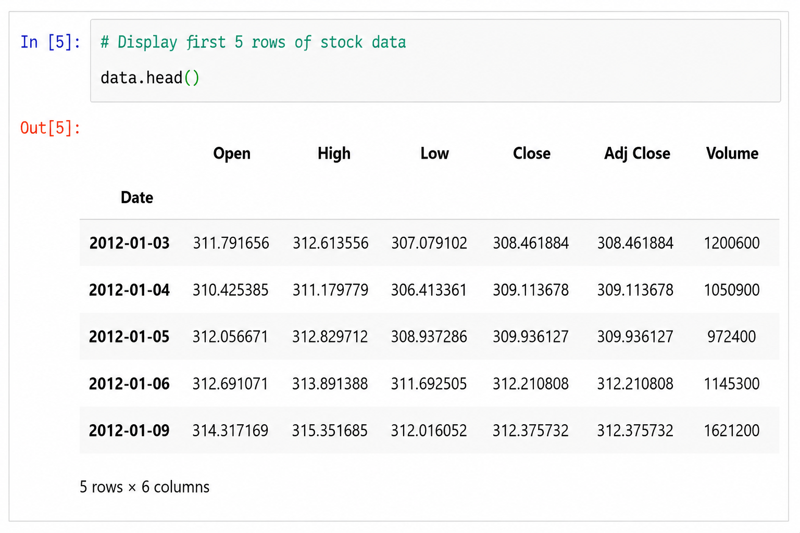
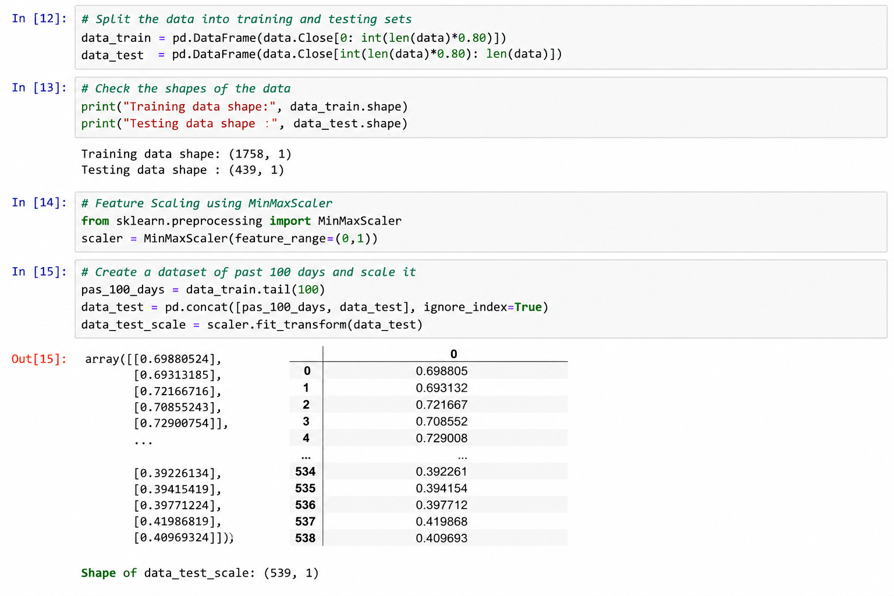
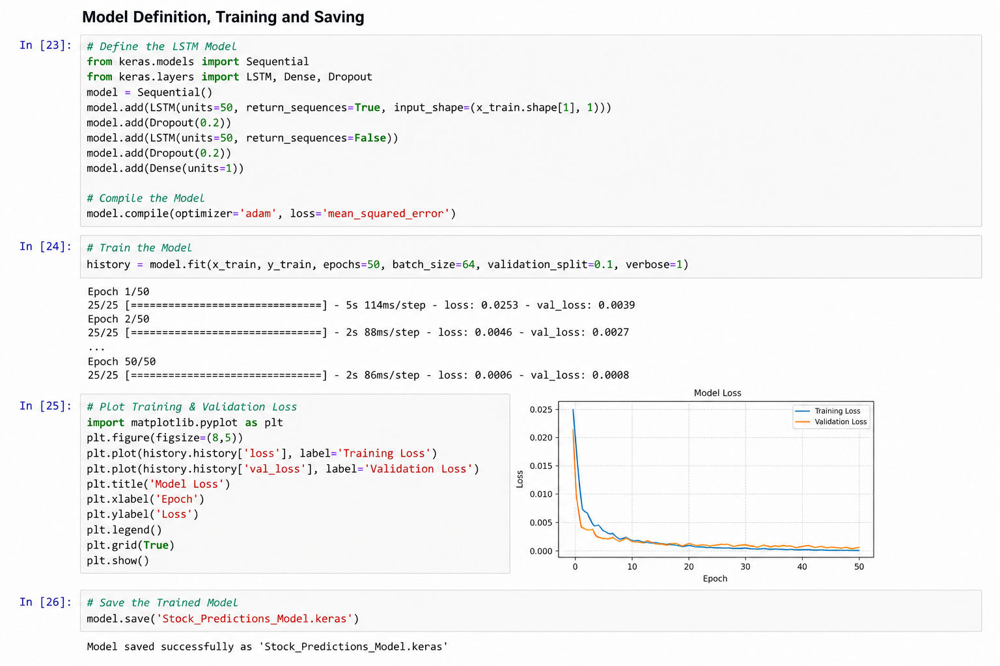
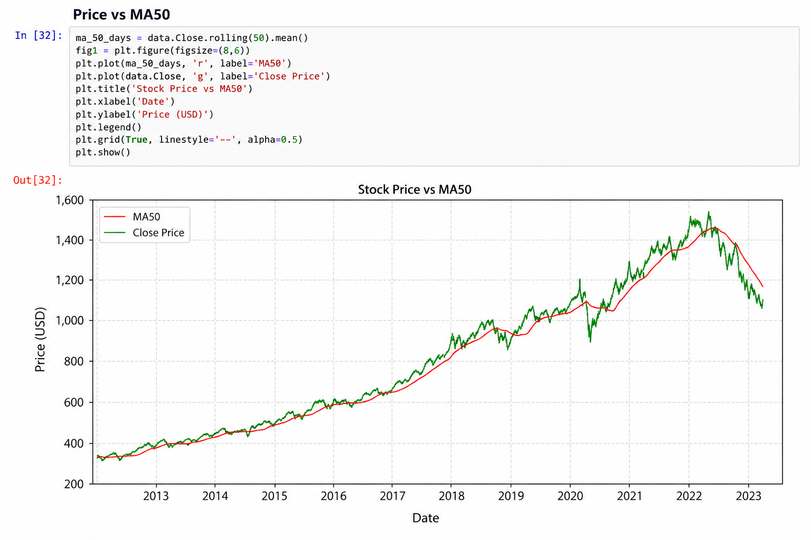
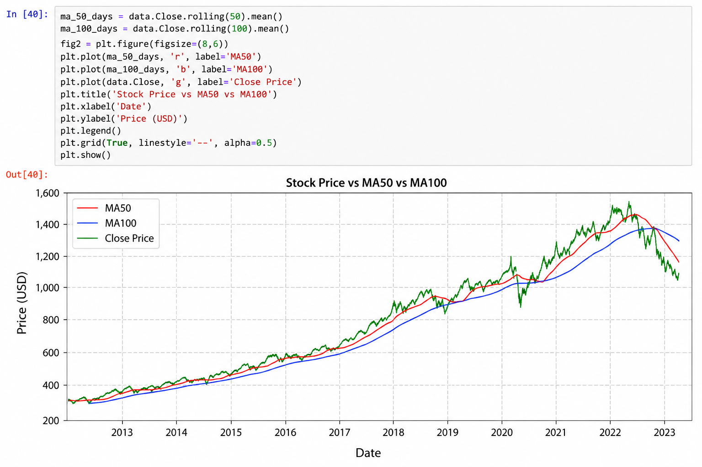
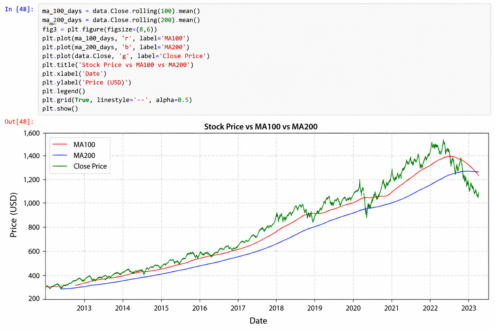
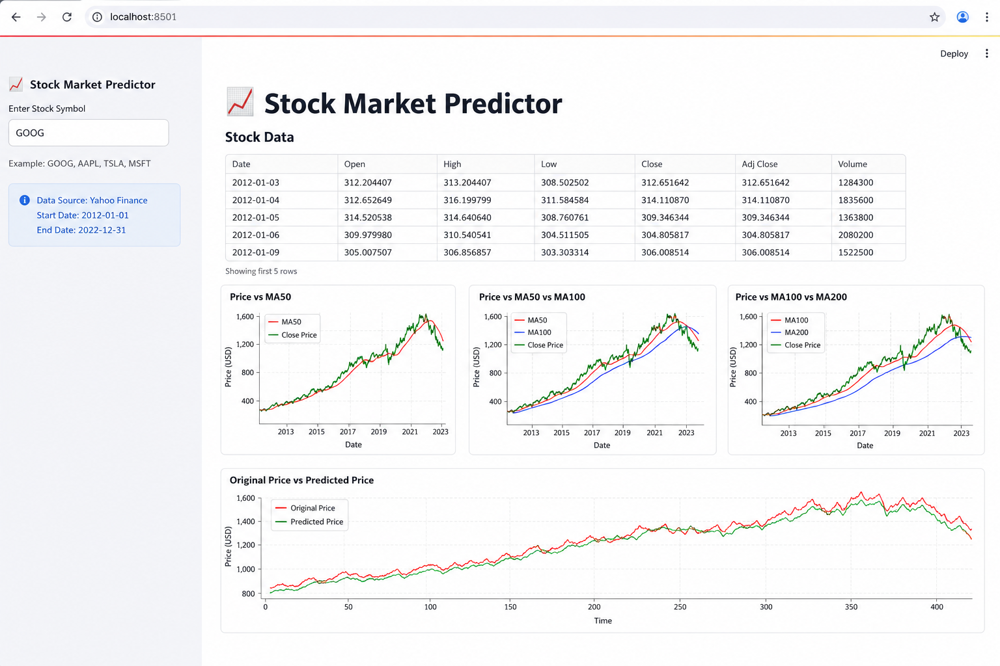
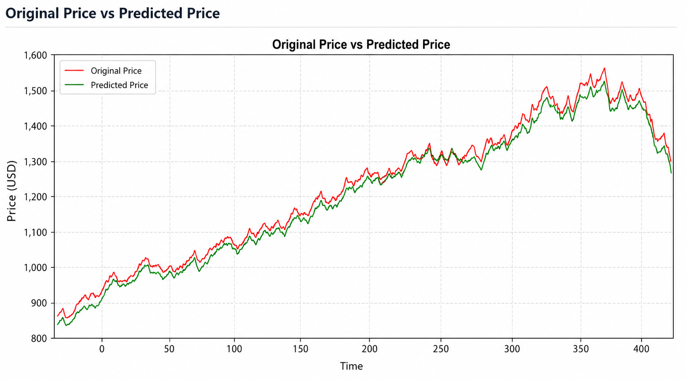

# 📈 Stock Market Price Prediction using LSTM

A Deep Learning project that predicts stock closing prices using an LSTM (Long Short-Term Memory) neural network. The application fetches historical stock data using Yahoo Finance, preprocesses it with MinMaxScaler, and visualizes predictions through an interactive Streamlit dashboard.

---

## ✨ Features

- Live Stock Data using Yahoo Finance
- Data Preprocessing
- MinMax Scaling
- LSTM Deep Learning Model
- Moving Average Visualization (MA50, MA100, MA200)
- Original vs Predicted Price Comparison
- Interactive Streamlit Web Application

---

## 🛠 Tech Stack

- Python
- TensorFlow / Keras
- Pandas
- NumPy
- Matplotlib
- Scikit-learn
- yfinance
- Streamlit

---

## 📂 Input

- Stock Symbol (Example: GOOG, AAPL, TSLA)

---

## ⚙️ Workflow

1. Fetch Historical Stock Data
2. Data Preprocessing
3. MinMax Scaling
4. Load Trained LSTM Model
5. Generate Predictions
6. Visualize Results
7. Display Prediction in Streamlit

---

## 🤖 Model

- Deep Learning Model : LSTM
- Framework : TensorFlow / Keras
- Feature Scaling : MinMaxScaler
- Optimizer : Adam
- Loss Function : Mean Squared Error

---

## 📸 Screenshots

### Dataset Preview

### Data Preprocessing

### Model Training

### Price vs MA50

### Price vs MA50 vs MA100

### Price vs MA100 vs MA200

### Streamlit Application

### Prediction Output

---

## 🚀 Future Improvements

- Multi-stock comparison
- Candlestick Charts
- Real-time Predictions
- GRU Model Comparison
- Transformer-based Forecasting

---

## 👨‍💻 Author

**Abhishek Prajapati**
